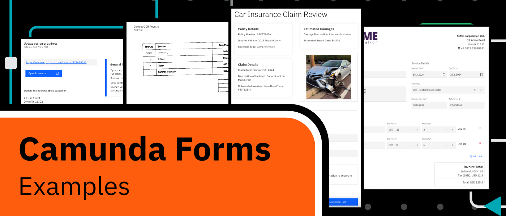
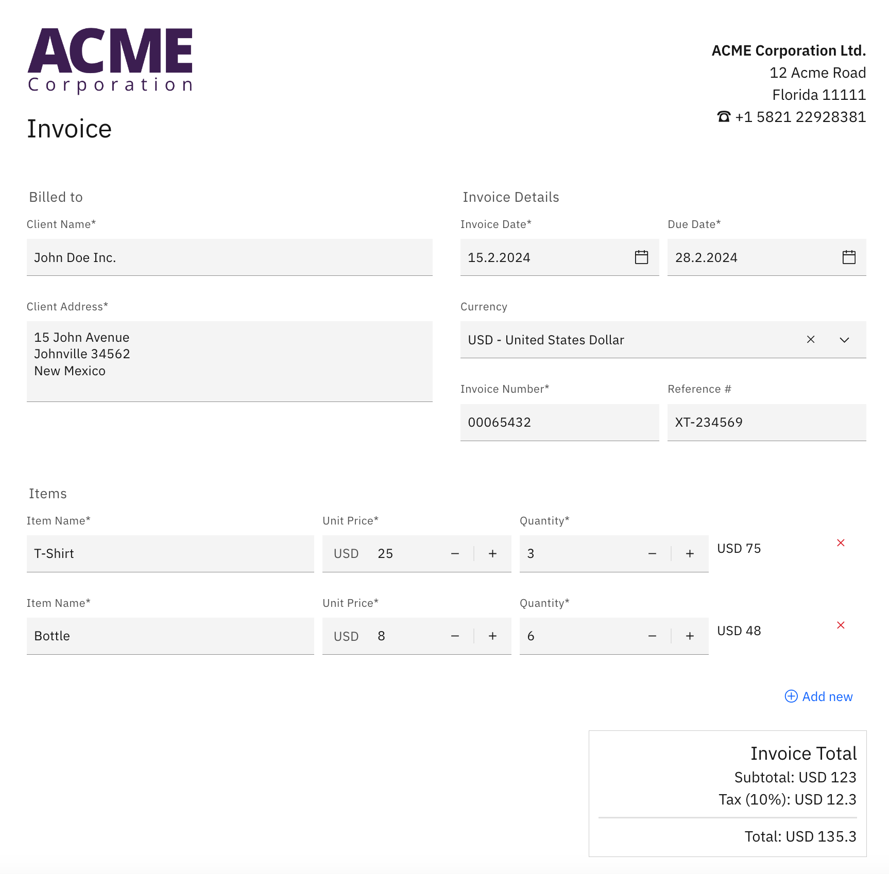
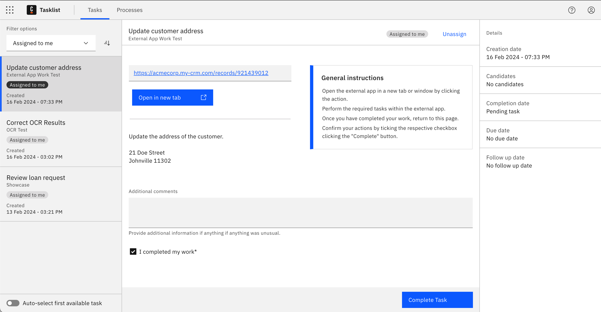
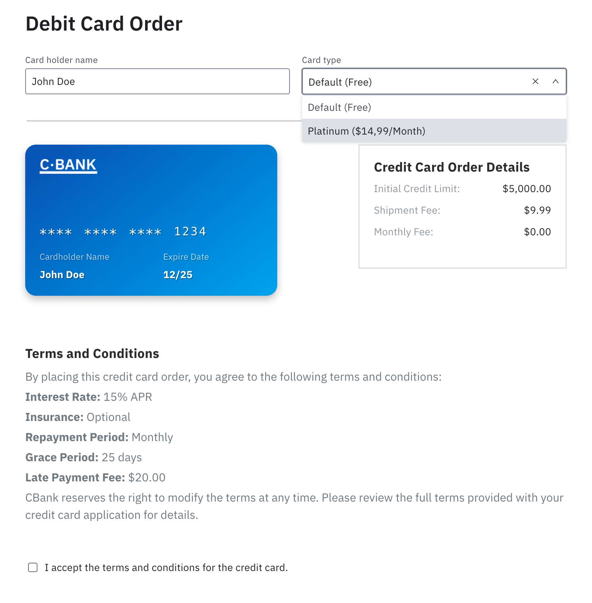
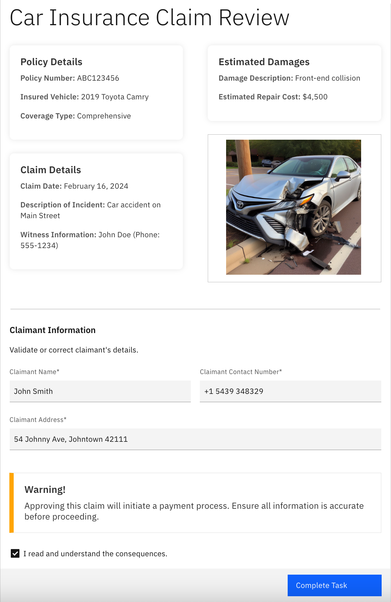
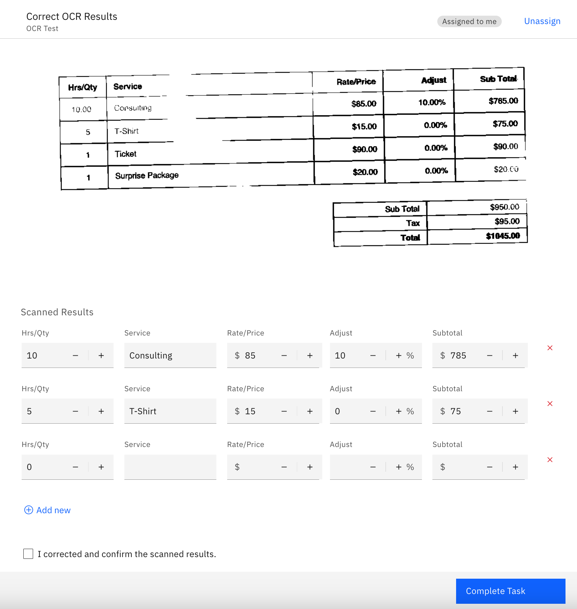
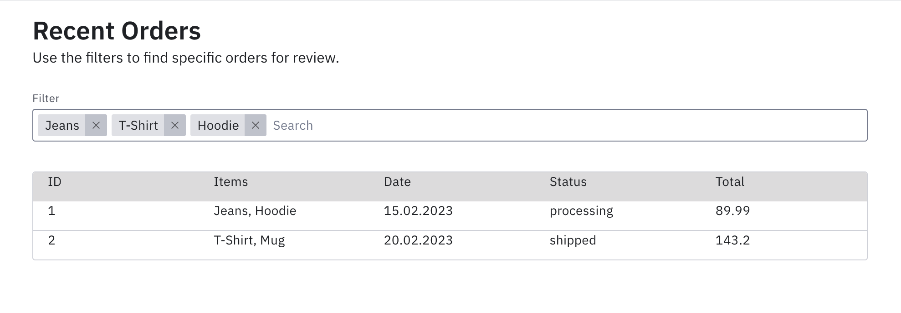

Camunda Forms Examples
---

This repository showcases a variety of use cases that can be solved with Camunda Forms. Use it to discover new use cases, understand technical capabilities, to find a way to get started quickly, or to get inspired.

## File format + structure

Form files are organized in folders for high-level use cases and domains. Files contain a prefix indicating the required Camunda version to run the form.

## Setup

Just upload the files to Web Modeler, or open them in Desktop Modeler. You can of course open them in any [form-js](https://github.com/bpmn-io/form-js/) distribution you like, including self-hosted.

## Highlights

### [Invoice Creator](./invoicing/)

<section markdown="1" style="display: flex;">

 
Create and review an invoice with a dynamic list of items and automatic total and tax calculations in a WYSIWYG editor.

</section>

### [External App Task](./external-app-orchestration/)

<section markdown="1" style="display: flex;">

 
Not every task can be worked on using a form. Many tasks require users to perform an action in an external system, such as updating a record in a CRM. Use this form to provide work instructions to users and route them to the respective external app. Users can capture additional comments in case something unexpected happened. 

</section>

### [Credit Card Order](./orders/)

<section markdown="1" style="display: flex;">

 
A simplified credit card order form, suitable to bootstrap a self-service account opening process.

</section>

### [Car Insurance Claim Review](./review/)

<section markdown="1" style="display: flex;">

 
Review a car insurance claim with an overview of relevant details, including pictures of the damage, and either approve or reject it.

</section>

### [OCR Validation](./data-validation/)

<section markdown="1" style="display: flex;">

 
Let users validate and correct results from an OCR scan. Improve your OCR accuracy by measuring the number of corrected rows.

</section>

### [Filterable Table](./filterable-table/)

<section markdown="1" style="display: flex;">

 
Filter table values using a configurable tag list and other components.

</section>
